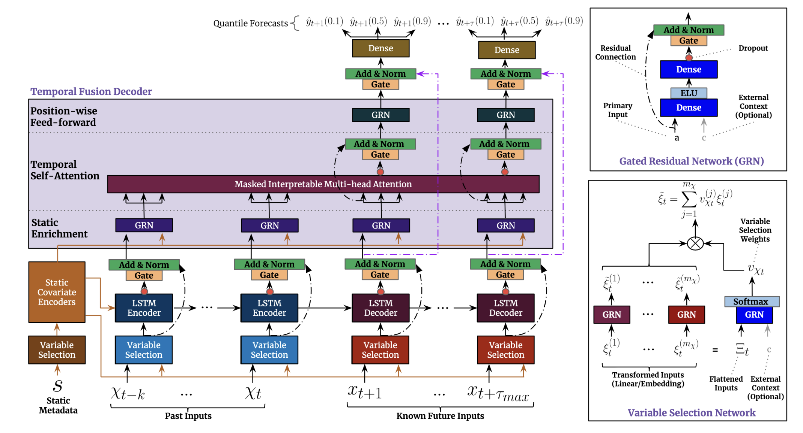

<h1 align = "center">
  Demand forecasting with Temporal Fusion Transformers  
</h1>

---

This repository contains a custom implementation of [Temporal Fusion Transformers for Interpretable Multi-horizon Time Series Forecasting](https://arxiv.org/pdf/1912.09363.pdf) using Lightning and pytorch_forecasting for demand forecasting on the [Stallion dataset](https://www.kaggle.com/datasets/utathya/future-volume-prediction).

## Technical details

Enhancements compared to the original implementation in [the Google Research repo](https://github.com/google-research/google-research/tree/master/tft):

* capabilities added through pytorch_forecasting base model e.g. monotone constraints
* static variables can be continuous
* multiple categorical variables can be summarized with an EmbeddingBag
* variable encoder and decoder length by sample
* categorical embeddings are not transformed by variable selection network (because it is a redundant operation)
* variable dimension in variable selection network are scaled up via linear interpolation to reduce
  number of parameters
* non-linear variable processing in variable selection network can be shared among decoder and encoder
  (not shared by default)

